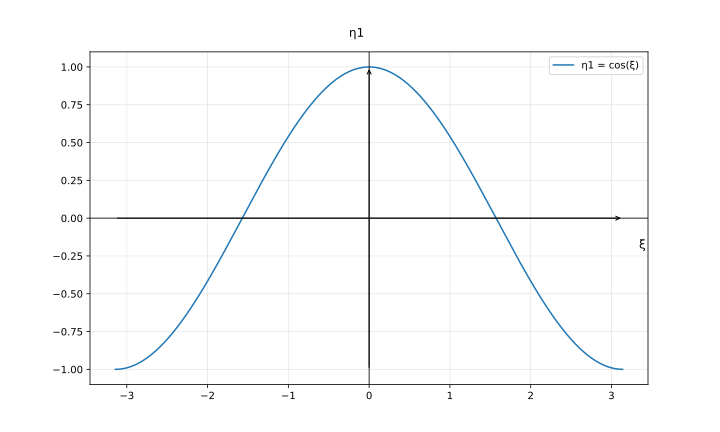
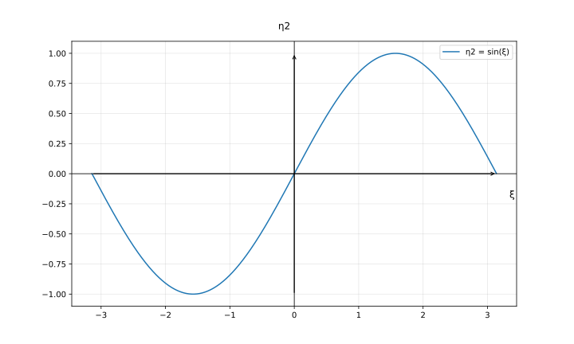
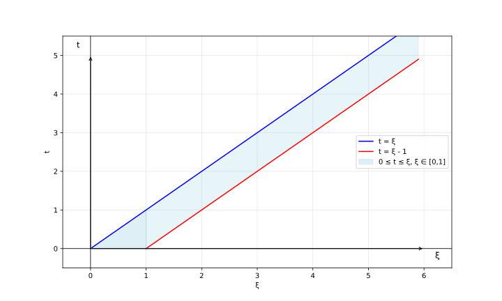

# Лабораторная работа №1

## 1.1 Вероятностное пространство, формула Байеса

### 1. Определить (с обоснованием), зависимы или независимы следующие события:
- Несовметсные события;

    **Решение:**

    По определению **несовместные** событий: $P(AB) = 0$.

    По определению **независимые** событий: $P(AB) = P(A)P(B)$.

    Таким образом: $P(A)P(B) = 0 \Rightarrow  P(A) = 0 \text{ или } P(B) = 0$.

    **Ответ:** несовместные события могут быть независимыми, если одно из них имеет нулевую вероятность, иначе - зависимые.

- Cобытия, образующие $\sigma$-алгебру $\Sigma$ в пространстве $(\Omega, \Sigma, \mathbb{P})$;

    **Решение:**

    По определению $\sigma$-алгебра:
    - если $A \in \sigma$, то $\overline{A} \in \sigma$;
    - если $A_1, \dots, A_n, \dots \in \sigma$, то $A_1 + \dots + A_n + \dots \in \sigma$.

    *Пример:* $\Omega = \left\lbrace1, 2, 3, 4\right\rbrace, \newline \sigma = \left\lbrace\left\lbrace1\right\rbrace, \left\lbrace2\right\rbrace, \left\lbrace3\right\rbrace, \left\lbrace4\right\rbrace,\left\lbrace1, 2\right\rbrace, \left\lbrace1, 3\right\rbrace, \left\lbrace1, 4\right\rbrace, \left\lbrace2, 3\right\rbrace, \left\lbrace2, 4\right\rbrace, \left\lbrace3, 4\right\rbrace, \left\lbrace1, 2, 3\right\rbrace, \left\lbrace1, 2, 4\right\rbrace, \left\lbrace2, 4, 3\right\rbrace\right\rbrace$ 
    
    - $A = \left\lbrace1, 2\right\rbrace, B = \left\lbrace1, 3\right\rbrace$
  
        $P(A) = \frac{1}{2}, \ P(B) = \frac{1}{2}$

        $P(AB) = P({1}) = \frac{1}{4}, \ P(A)P(B) = \frac{1}{4} \Rightarrow A, B - \text{независимые}$  
    - $A = \left\lbrace1, 2, 3\right\rbrace, B = \left\lbrace1, 2\right\rbrace$
        
        $P(A) = \frac{3}{4}, \ P(B) = \frac{1}{2}$

        $P(AB) = P({1, 2}) = \frac{1}{2}, \ P(A)P(B) = \frac{3}{8} \Rightarrow A, B - \text{зависимые}$
    
    **Ответ:** события, образующие $\sigma$-алгебру могут быть как зависимые, так и независимые.

- События, имеющие одинаковую вероятность.

    ToDO

### 2. Опыт заключается в независимом подбрасывании двух симметричных монет. Рассматриваются следующие события:
- $A$ - появление герба на первой монете;
- $B$ - появление решки на первой монете;
- $C$ - появление герба на второй монете;
- $D$ - появление решки на второй монете;
- $E$ - появление хотя бы одного герба;
- $F$ - появление хотя бы одной решки;
- $G$ - появление одного герба и одной решки;
- $H$ - непоявление ни одного герба;
- $K$ - появление двух гербов.

    **Решение:**
    
    $\Omega = \left\lbrace \text{(Г, Р)}, \text{(Р, Г)}, \text{(Г, Г)}, \text{(Р, Р)}, \right\rbrace$
    - $A$ - появление герба на первой монете $\left\lbrace \text{(Г, Р)}, \text{(Г, Г)}\right\rbrace$;
    - $B$ - появление решки на первой монете $\left\lbrace \text{(Р, Р)}, \text{(Р, Г)}\right\rbrace$;
    - $C$ - появление герба на второй монете $\left\lbrace \text{(Г, Г)}, \text{(Р, Г)}\right\rbrace$;
    - $D$ - появление решки на второй монете $\left\lbrace \text{(Г, Р)}, \text{(Р, Р)}\right\rbrace$;
    - $E$ - появление хотя бы одного герба $\left\lbrace \text{(Г, Г)}, \text{(Г, Р)}, \text{(Р, Г)}\right\rbrace$;
    - $F$ - появление хотя бы одной решки $\left\lbrace \text{(Р, Р)}, \text{(Г, Р)}, \text{(Р, Г)}\right\rbrace$;
    - $G$ - появление одного герба и одной решки $\left\lbrace \text{(Г, Р)}, \text{(Р, Г)}\right\rbrace$;
    - $H$ - непоявление ни одного герба $\left\lbrace \text{(Р, Р)}\right\rbrace$;
    - $K$ - появление двух гербов $\left\lbrace \text{(Г, Г)}\right\rbrace$.

    Определим, каким событиям этого списка равносильны следующие события:

    - $A + C = \left\lbrace \text{(Г, Р)}, \text{(Г, Г)}\right\rbrace \cup \left\lbrace \text{(Г, Г)}, \text{(Р, Г)}\right\rbrace = \left\lbrace \text{(Г, Г)}, \text{(Г, Р)}, \text{(Р, Г)} \right\rbrace = E \ \text{(появление хотя бы одного орла)}$

        **Ответ**: $A + C = E$ 
    - $AC = \left\lbrace \text{(Г, Р)}, \text{(Г, Г)}\right\rbrace \cap \left\lbrace \text{(Г, Г)}, \text{(Р, Г)}\right\rbrace = \left\lbrace \text{(Г, Г)} \right\rbrace = K \ \text{(появление двух гербов)}$
  
        **Ответ**: $AC = K$  
    - $EF = \left\lbrace \text{(Г, Г)}, \text{(Г, Р)}, \text{(Р, Г)}\right\rbrace \cap \left\lbrace \text{(Р, Р)}, \text{(Г, Р)}, \text{(Р, Г)}\right\rbrace = \left\lbrace \text{(Г, Р)}, \text{(Р, Г)} \right\rbrace = G \ \text{(появление одного герба и одной решки)}$
     
        **Ответ**: $EF = G$  
    - $G + E = \left\lbrace \text{(Г, Р)}, \text{(Р, Г)}\right\rbrace \cup \left\lbrace \text{(Г, Г)}, \text{(Г, Р)}, \text{(Р, Г)}\right\rbrace = \left\lbrace \text{(Г, Р)}, \text{(Р, Г)}, \text{(Г, Г)} \right\rbrace = E \ \text{(появление хотя бы одного герба)}$
     
        **Ответ**: $G + E = E$ 
    - $GE = \left\lbrace \text{(Г, Р)}, \text{(Р, Г)}\right\rbrace \cup \left\lbrace \text{(Г, Г)}, \text{(Г, Р)}, \text{(Р, Г)}\right\rbrace = \left\lbrace \text{(Г, Р)}, \text{(Р, Г)}\right\rbrace = G \ \text{(появление одного герба и одной решки)}$

        **Ответ**: $GE = G$  
    - $BD = \left\lbrace \text{(Р, Р)}, \text{(Р, Г)}\right\rbrace \cap \left\lbrace \text{(Г, Р)}, \text{(Р, Р)}\right\rbrace = \left\lbrace \text{(Р, Р)}\right\rbrace = H \ \text{(непоявление ни одного герба)}$

        **Ответ**: $GE = H$   
    - $E + K =\left\lbrace \text{(Г, Г)}, \text{(Г, Р)}, \text{(Р, Г)}\right\rbrace \cup \left\lbrace \text{(Г, Г)}\right\rbrace = \left\lbrace \text{(Г, Г)}, \text{(Г, Р)}, \text{(Р, Г)} \right\rbrace = G \ \text{(появление хотя бы одного герба)}$
     
        **Ответ**: $E + K = E$

### 3. Производится выстрел по вращающейся круговой мишени, в которой закрашены два непересекающихся сектора с углом 20◦. Какова вероятность попадания в закрашенную область?

**Решение:**

1. Полный круг - $360\degree$;
2. Два непересекающихся сектора с углом $20\degree \Rightarrow \ \text{общая закрашенная площадь} = 40\degree$
3. Вероятность попадания в закрашенную область: $P = \frac{40\degree}{360\degree} = \frac{1}{9}$
  
**Ответ:** $\frac{1}{9}$

### 4. Два парохода должны подойти к одному и тому же причалу независимо друг от друга и равновозможно в течение суток. Определить вероятность того, что одному из них придется ожидать освобождения причала, если время стоянки первого парохода - 1 час, а второго - 2 часа.

Вероятность того, что одному из них придется ожидать освобождения причала = 1 - вероятность того, что никто из них не будет ждать освобождения причала

**Решение:**

Пусть $x$ - момент прибытия 1го корабля, $y$ - 2го; $x, y \in [0, 24]$.

Время стоянки 1го корабля: $x, x + 1$.

Время стоянки 2го корабля: $y, y + 2$.

Если **1й пришел раньше** ($x \ge y$): для того, чтобы **2й корабль не ждал**, он должен прийти в момент $y \ge x + 1$.

Если **2й пришел раньше** ($y > x$): для того, чтобы **1й корабль не ждал**, он должен прийти в момент $x \le y - 2$.

Получаем систему уравнений:

$$
\left\lbrace \begin{array}{cl}
y \ge x + 1, & x \ge y\\
y \le x - 2, & x \le y
\end{array} \right. 
$$

Найдем закрашенные площади: $23 * 23 * 0.5 + 22 * 11 = 506.5$.

Вероятность того, что никто **не будет** ождать: $\frac{506.5}{576}$.

Вероятность того, что один из них **будет** ождать: $1 - \frac{506.5}{576} = \frac{69.5}{576} = \frac{139}{1152}$

**Ответ:** $\frac{139}{1152}$

### 5. Самолет, по которому ведется стрельба, состоит из трех различных по уязвимости частей:
1. Кабина летчика и двигатель
2. Топливные баки
3. Планер

Для поражения самолета достаточно либо одного попадания в первую часть, либо двух попаданий во вторую, либо трех в третью. При попадании в самолет одного снаряда, снаряд с вероятностью p1 попадает в первую часть, с вероятностью p2 — во вторую, с вероятностью p3 — в третью. Попавшие снаряды распределяются по частям независимо друг от друга. Известно, что в самолет попало m снарядов. Найти условную вероятность P(A|m) события A – «Самолет поражен» – при m = 1, 2, 3, 4

**Решение:**

Введем $p_0 = 1 - p_1 - p_2 - p_3$ - вероятность не попасть в самолет (промах).

Событие $A$ - самолет поражен.

Пусть $X_1, X_2, X_3$ - число попаданий в части 1 - 3 при $m$ выстрелах. Это полиномиальное распределение.

$$
A = \left\lbrace X_1 \ge 1 \right\rbrace \cup \left\lbrace X_2 \ge 2\right\rbrace \cup \left\lbrace X_3 \ge 3\right\rbrace
$$

Вероятность $(P)$ того, что исход 1 произойдёт ровно $n_1$ раз, исход 2 - ровно $n_2$ раз, …, исход k - ровно $n_k$ раз, вычисляется по формуле: $P = \frac{n!}{n_1!n_2!…n_k!} (p_1^{n_1}p_2^{n_2}…p_k^{n_{k}})$, где $n = n_1 + n_2 + … + n_k$.

1. m = 1

    Самолет был сбит с 1го раза, то есть сразу попали в **часть 1**.

    $P(A | m = 1) = p_1^1p_2^0p_3^0p_0^0 = p_1$
3. m = 2
   
   Самолет был сбит со 2го раза, то есть:
   - 2 раза били в **часть 2**
   - хотя бы одно попадание в **часть 1**
  
    $P(A | m = 2) = p_2 ^ 2 + 2(1 - p_1)p_1 = 2p_1 - p_1^2 + p_2 ^ 2$
4. m = 3
   
   Рассмотрим собитие $\bar{A}: \left\lbrace X_1 = 0 \right\rbrace \cup \left\lbrace X_2 \le 1\right\rbrace \cup \left\lbrace X_3 \le 2\right\rbrace$

   $\bar{A}: X_1 = 0, X_2 \le 1, X_3 \le 2$

   Сумма $X_2 + X_3 + X_0 = 3, X_1 = 0$

   - $X_2 = 0, X_3 = 0, 1, 2$, остальное в $X_0$
    
        $P = \sum_{k = 0}^{2}\frac{3!}{k!(3-k)!}p_{3}^{k}p_{0}^{3 - k}$

   - $X_2 = 1, X_3 = 0, 1, 2$
    
        $P = \sum_{k = 0}^{2} \frac{3!}{1!k!(2-k)!}p_{2}p_{0}^{k}p_{3}^{2 - k}$ 
    
    $P(A | m = 3) = 1 - \sum_{k = 0}^{2} \frac{3!}{k!(3-k)!} p_{3}^{k}p_{0}^{3 - k} - \sum_{k = 0}^{2} \frac{3!}{1!k!(2-k)!}p_{2}p_{0}^{k}p_{3}^{2 - k}$
5. m = 4
    
    $\bar{A}: X_1 = 0, X_2 \le 1, X_3 \le 2$

    Сумма $X_2 + X_3 + X_0 = 4, X_1 = 0$
   
   - $X_2 = 0, X_3 = 0, 1, 2$, остальное в $X_0$
    
        $P = \sum_{k = 0}^{2}
        \frac{4!}{k!(4-k)!}p_{3}^{k}p_{0}^{4 - k}$

   - $X_2 = 1, X_3 = 0, 1, 2$, остальное в $X_0$
    
        $P = \sum_{k = 0}^{2} \frac{4!}{1!k!(3-k)!}p_{2}p_{0}^{k}p_{3}^{3 - k}$ 
    
    $P(A | m = 4) = 1 - \sum_{k = 0}^{2} \frac{4!}{k!(4-k)!} p_{3}^{k}p_{0}^{3 - k} - \sum_{k = 0}^{2} \frac{4!}{1!k!(3-k)!}p_{2}p_{0}^{k}p_{3}^{3 - k}$

**Ответ:**
1. $P(A | m = 1) = p_1^1p_2^0p_3^0p_0^0 = p_1$
2. $P(A | m = 2) = p_2 ^ 2 + 2(1 - p_1)p_1 = 2p_1 - p_1^2 + p_2 ^ 2$
3. $P(A | m = 3) = 1 - \sum_{k = 0}^{2} \frac{3!}{k!(3-k)!} p_{3}^{k}p_{0}^{3 - k} - \sum_{k = 0}^{2} \frac{3!}{1!k!(2-k)!}p_{2}p_{0}^{k}p_{3}^{2 - k}$
4. $P(A | m = 4) = 1 - \sum_{k = 0}^{2} \frac{4!}{k!(4-k)!} p_{3}^{k}p_{0}^{3 - k} - \sum_{k = 0}^{2} \frac{4!}{1!k!(3-k)!}p_{2}p_{0}^{k}p_{3}^{3 - k}$

## 1.2 Cлучайный вектор и числовые характеристики

### 1. Пусть

$$
f_{\xi} = \frac{e^{-2 |y|}}{\pi(1 + x^2)}
$$

Является ли данная функция плотностью распределения случайного
вектора?

**Решение:**

Свойства функции плотности распределения:
1. $f_{\xi}(x, y) \ge 0$ для всех $x, y \in \mathbb{R^2}$
2. $\underset{\mathbb{R^2}}{\int_{}^{}\int_{}^{}}f_{\xi}(x, y)dxdy = 1$

Проверим эти свойства:
1. $\left\lbrace \begin{array}{cl} e^{-2 |y|} > 0 & y \in (-\infty , +\infty )\\ \pi(1 + x^2) > 0 & x \in (-\infty , +\infty )\end{array} \right.$
2. $\int_{-\infty}^{\infty}\int_{-\infty}^{\infty}\frac{e^{-2 |y|}}{\pi(1 + x^2)}dxdy = \left[ \int_{-\infty}^{\infty} \frac{dx}{\pi(1 + x^2)} \right]\left[ \int_{-\infty}^{\infty}e^{-2 |y|} dy\right]$
   
   1. $\int_{-\infty}^{\infty} \frac{dx}{\pi(1 + x^2)} = \frac{1}{\pi}\int_{-\infty}^{\infty} \frac{dx}{1 + x^2} = \frac{1}{\pi}\arctan|_{-\infty}^{\infty} = \frac{1}{\pi}(\frac{\pi}{2} - (-\frac{\pi}{2})) = 1$
   2. $\int_{-\infty}^{\infty}e^{-2 |y|} dy = \int_{-\infty}^{0}e^{2y} dy + \int_{0}^{\infty}e^{-2y} dy = 2\int_{0}^{\infty}e^{-2y} dy = -e^{-2y}|_0^{\infty} = 0 - (-1) = 1$
    
    $\underset{\mathbb{R^2}}{\int_{}^{}\int_{}^{}}f_{\xi}(x, y)dxdy = 1$

**Ответ:** да, является 

### 2. Совместное распределение случайных величин ξ и η задано следующей таблицей

$$
\begin{array}{|c|c|c|c|}
\hline
\xi \backslash \eta & -1 & 0 & 1 \\
\hline
-1 & \frac{1}{8} & \frac{1}{12} & \frac{7}{24} \\
\hline
1 & \frac{1}{3} & \frac{1}{6} & 0 \\
\hline
\end{array}
$$

 - Найти маргинальные распределения $\xi$ и $\eta$
    
    **Решение:**

$$
\begin{array}{|c|c|c|c|c|}
\hline
\xi \backslash \eta & -1 & 0 & 1 & P_\xi\\
\hline
-1 & \frac{1}{8} & \frac{1}{12} & \frac{7}{24} & \frac{1}{2}\\
\hline
1 & \frac{1}{3} & \frac{1}{6} & 0 & \frac{1}{2}\\
\hline
P_\eta & \frac{11}{24} & \frac{1}{4} & \frac{7}{24} & 1\\
\hline
\end{array}
$$

Ряд распределения СВ $\xi$: 
$$
\begin{array}{|c|c|c|}
\hline
\xi & -1 & 1 \\
\hline
P & \frac{1}{2} & \frac{1}{2}  \\
\hline
\end{array}
$$

Ряд распределения СВ $\eta$: 
$$
\begin{array}{|c|c|c|c|}
\hline
\eta & -1 & 0 & 1 \\
\hline
P & \frac{11}{24} & \frac{1}{4} & \frac{7}{24} \\
\hline
\end{array}
$$
    
 - Вычислить математическое ожидание, ковариационную и корреляционную матрицы вектора $(\xi, \eta)$  

    **Решение:**

    $E\xi = \frac{1}{2}*(-1) + \frac{1}{2}*1 = 0$

    $E\eta = \frac{11}{24}*(-1) + \frac{7}{24}*1 = -\frac{1}{6}$

    $E(\xi, \eta) = (0, \frac{1}{6})$

    $\text{cov}(\xi, \eta) = \sum_{i}^{}\sum_{j}^{}(\xi_i - E\xi)(\eta_j - E\eta)p_{ij} = -\frac{1}{2}$

    Ковариационная матрица:
    $$
    \Sigma_{(\xi, \eta)} = 
    \begin{pmatrix}
        D\xi & \text{cov}(\xi, \eta) \\
        \text{cov}(\eta, \xi) & D\eta
    \end{pmatrix}
    $$

    $D\xi = E\xi^2 - (E\xi) ^ 2 = 1 * \frac{1}{2} + 1 * \frac{1}{2} - 0 = 1$

    $D\eta = E\eta^2 - (E\eta) ^ 2 = 1 * \frac{11}{24} + 1 * \frac{7}{24} - \frac{1}{36} = \frac{13}{18}$

    $$
    \Sigma_{(\xi, \eta)} = 
    \begin{pmatrix}
        1 & -\frac{1}{2} \\
        -\frac{1}{2} & \frac{13}{18}
    \end{pmatrix}
    $$

    Корреляционная матрица
    $$
    P_{\xi, \eta)} = 
    \begin{pmatrix}
        \rho(\xi, \xi) & \rho(\xi, \eta) \\
        \rho(\eta, \xi) & \rho(\eta, \eta)
    \end{pmatrix}
    $$

    $\rho(\xi, \eta) = \frac{\text{cov}(\xi, \eta)}{\sqrt{D\xi D\eta}} = \frac{-\frac{1}{2}}{\sqrt{\frac{13}{18}}} = -\frac{3\sqrt{26}}{26}$

    $$
    P_{(\xi, \eta)} = 
    \begin{pmatrix}
        1 & -\frac{3\sqrt{26}}{26} \\
        -\frac{3\sqrt{26}}{26} & 1
    \end{pmatrix}
    $$

 - Исследовать $\xi$ и $\eta$ на независимость и некоррелированность

    **Решение:**

    1. Так как $\text{cov}(\xi, \eta) \neq 0$, то они **коррелированы**

    2. $\xi, \eta$ независимы, если: $p_{ij} = P(\xi = \xi_i) P(\eta = \eta_j)$
    
    $P(\xi = -1, \eta = -1) = \frac{1}{8} \\ P(\xi = -1) * P(\eta = -1) = \frac{1}{2} * \frac{11}{24} = \frac{11}{48} \\
    \frac{11}{48} \neq \frac{1}{8} \Rightarrow \xi, \eta$ - **зависимы**

### 3. Пусть имеются два одинаковых тетраэдра с числами 1, 2, 3, 4 на гранях. Подкидываем оба и смотрим на выпавшие числа ξ1 и ξ2. Зададим следующие случайные величины:

$$
\phi_1 = \xi_1 + \xi_2 \quad \phi_2 = \left\lbrace \begin{array}{cl}
1, & (\xi_1 \vdots \xi_2) \ \cup \ (\xi_2 \vdots \xi_1)\\
0, & \text{else}
\end{array} \right. 
$$

- Cоставить таблицу совместного распределения $\phi_1$ и $\phi_2$
  
    **Решение:**
    
    $\phi_1$ принимает значения: $2, 3, 4, 5, 6, 7, 8$
    
    $2 - (1, 2) \\ 3 - (1, 2), (2, 1) \\ 4 - (1, 3), (3, 1), (2, 2) \\ 5 - (1, 4), (4, 1), (2, 3), (3, 2) \\ 6 - (2, 4), (4, 2), (3, 3) \\ 7 - (3, 4), (4, 3) \\ 8 - (4, 4)$

    $\phi_2$ принимает значения: $0, 1$

    $0 - (2, 3), (3, 2), (4, 3), (3, 4) \\ 1 - (1, 1), (1, 2), (1, 3), (1, 4), (2, 1), (2, 2), (2, 4), (3, 1), (3, 3), (4, 1), (4, 2), (4, 4)$

    $$
    \begin{array}{|c|c|c|c|c|c|c|c|c|}
    \hline
    \phi_2 \backslash \phi_1 & 2 & 3 & 4 & 5 & 6 & 7 & 8 & P_{\phi_2}\\
    \hline
    0 & 0 & 0 & 0 & \frac{1}{8} & 0 & \frac{1}{8} & 0 & \frac{1}{4}\\
    \hline
    1 & \frac{1}{16} & \frac{2}{16} & \frac{3}{16} & \frac{1}{8} & \frac{3}{16} & 0 & \frac{1}{16} & \frac{3}{4}\\
    \hline
    P_{\phi_1} & \frac{1}{16} & \frac{2}{16} & \frac{3}{16} & \frac{4}{16} & \frac{3}{16} & \frac{2}{16} & \frac{1}{16} & 1\\
    \hline
    \end{array}
    $$

- Найти маргинальные распределения $\phi_1$ и $\phi_2$
  
    **Решение:**

    Ряд распределения СВ $\phi_1$: 
    $$
    \begin{array}{|c|c|c|c|c|c|c|c|}
    \hline
    \phi_1 & 2 & 3 & 4 & 5 & 6 & 7 & 8 \\
    \hline
    P & \frac{1}{16} & \frac{2}{16} & \frac{3}{16} & \frac{4}{16} & \frac{3}{16} & \frac{2}{16} & \frac{1}{16} \\
    \hline
    \end{array}
    $$

    Ряд распределения СВ $\phi_2$: 
    $$
    \begin{array}{|c|c|c|}
    \hline
    \phi_2 & 0 & 1 \\
    \hline
    P & \frac{1}{3} & \frac{3}{4} \\
    \hline
    \end{array}
    $$

- Вычислить математическое ожидание, ковариационную и корреляционную матрицы вектора $(\phi_1, \phi_2)$
  
    **Решение:**

    $E\phi_1 = 2 * \frac{1}{16} + 3 * \frac{2}{16} + 4 * \frac{3}{16} + 5 * \frac{4}{16} + 6 * \frac{3}{16} + 7 * \frac{1}{16} + 8 * \frac{1}{16} = 5$

    $E\phi_2 = \frac{3}{4}$

    $E(\phi_1, \phi_2) = (5, \frac{3}{4})$

    $\text{cov}(\phi_1, \phi_2) = \sum_{i}^{}\sum_{j}^{}(\phi_{1i} - E\phi_1)(\phi_{2j} - E\phi_2)p_{ij} = -\frac{1}{4}$

    Ковариационная матрица:
    $$
    \Sigma_{(\phi_1, \phi_2)} = 
    \begin{pmatrix}
        D\phi_1 & \text{cov}(\phi_1, \phi_2) \\
        \text{cov}(\phi_1, \phi_2) & D\phi_2
    \end{pmatrix}
    $$

    $D\phi_1 = E\phi_1^2 - (E\phi_1) ^ 2 = \frac{55}{2} - 25 = 2.5$

    $D\phi_2 = E\phi_2^2 - (E\phi_2) ^ 2 = \frac{3}{4} - \frac{9}{16} = \frac{3}{16}$

    $$
    \Sigma_{(\xi, \eta)} = 
    \begin{pmatrix}
        2.5 & -\frac{1}{4} \\
        -\frac{1}{4} & \frac{3}{16}
    \end{pmatrix}
    $$

    Корреляционная матрица
    $$
    P_{(\phi_1, \phi_2)} = 
    \begin{pmatrix}
        \rho(\phi_1, \phi_1) & \rho(\phi_1, \phi_2) \\
        \rho(\phi_2, \phi_1) & \rho(\phi_2, \phi_2)
    \end{pmatrix}
    $$

    $\rho(\phi_1, \phi_2) = \frac{\text{cov}(\phi_1, \phi_2)}{\sqrt{D\phi_1 D\phi_2}} = \frac{-\frac{1}{4}}{\sqrt{\frac{5}{2}* \frac{3}{16}}} = -\frac{\sqrt{30}}{15}$

    $$
    P_{(\phi_1, \phi_2)} = 
    \begin{pmatrix}
        1 & -\frac{\sqrt{30}}{15} \\
        -\frac{\sqrt{30}}{15} & 1
    \end{pmatrix}
    $$

- Исследовать $\phi_1$ и $\phi_2$ на независимость и некоррелированность

    **Решение:**

    1. Так как $\text{cov}(\phi_1, \phi_2) \neq 0$, то они **ytкоррелированы**

    2. $\phi_1, \phi_2$ независимы, если: $p_{ij} = P(\phi_1 = \phi_{1i}) P(\phi_2 = \phi_{2j})$
    
    $P(\phi_1 = 2, \phi_2 = 0) = 0 \\ P(\phi_1 = 2) * P(\phi_2 = 0) = \frac{1}{16} * \frac{1}{4} = \frac{1}{64} \\
    0 \neq \frac{1}{64} \Rightarrow \phi_1, \phi_2$ - **зависимы**

### 4. Пусть $\xi \sim \text{U}_{-\pi, \pi}$ и $\eta_1 = \cos{\xi}, \eta_2 = \sin{\xi}$

- Вычислить математическое ожидание, ковариационную и корреляционную матрицы вектора $(\eta_1, \eta_2)$
  
    **Решение:**

    1. 
        $$
        f_\xi = \left\lbrace \begin{array}{cl} 
        \frac{1}{2\pi}, & \xi \in [-\pi, \pi]\\
        0, & \text{else}
        \end{array} \right.
        $$

    2. $\varphi(\xi) = \eta_1; \xi = \varphi^{-1}(\eta_1) = \psi(\eta_1)$
     
        

        $\eta_1 = \cos{\xi}$ не является монотонной на интервале $\xi \in [-\pi, \pi]$

        $\xi: [-\pi, 0] - \cos\xi$ возрастает от $-1$ до $1$

        $\xi: [0, \pi] - \cos\xi$ убывает от $1$ до $-1$  

        $\xi_1 = \arccos{\eta_1} \text{ лежит в } [0, \pi]\\ \xi_2 = -\arccos{\eta_1} \text{ лежит в } [-\pi, 0]$

    3. $f_{\eta_1}(\eta_1) = \Sigma f_\xi(\psi(\eta_1))|\psi'(\eta_1)| \text{ где } \psi(\eta_1) = \arccos{\eta_1}$

        $\psi_1(\eta_1) = \arccos{\eta_1} \quad \psi_1'(\eta_1) = -\frac{1}{\sqrt{1 - \eta_1^2}} \\ \psi_2(\eta_1) = -\arccos{\eta_1} \quad \psi_2'(\eta_1) = \frac{1}{\sqrt{1 - \eta_1^2}}$

        $f_{\eta_1}(\eta_1) = \frac{1}{2\pi} * \frac{1}{\sqrt{1 - \eta_1^2}} + \frac{1}{2\pi} * \frac{1}{\sqrt{1 - \eta_1^2}} = \frac{1}{\pi \sqrt{1 - \eta_1^2}}$

        $$
        f_{\eta_1}(\eta_1) = \left\lbrace \begin{array}{cl} 
        \frac{1}{\pi \sqrt{1 - \eta_1^2}}, & \eta_1 \in [-1, 1]\\
        0, & \text{else}
        \end{array} \right.
        $$

    4. $\varphi(\xi) = \eta_2; \xi = \varphi^{-1}(\eta_2) = \psi(\eta_2)$

            

        $\eta_2 = \sin{\xi}$ не является монотонной на интервале $\xi \in [-\pi, \pi]$

        $\xi: [-\pi, -\frac{\pi}{2}] - \sin\xi$ убывает от $0$ до $-1$

        $\xi: [-\frac{\pi}{2}, \frac{\pi}{2}] - \sin\xi$ возрастает от $-1$ до $1$

        $\xi: [\frac{\pi}{2}, \pi] - \sin\xi$ убывает от $1$ до $0$

        $\xi_1 = \arcsin{\eta_2} \text{ лежит в } [-\frac{\pi}{2}, \frac{\pi}{2}]\\ \xi_2 = \pi -\arcsin{\eta_1} \text{ лежит в } [\frac{\pi}{2}, \frac{3\pi}{2}]$

    5. $f_{\eta_2}(\eta_2) = \Sigma f_\xi(\psi(\eta_2))|\psi'(\eta_2)| \text{ где } \psi(\eta_2) = \arcsin{\eta_2}$ 

        $\psi_1(\eta_2) = \arcsin{\eta_2} \quad \psi_1'(\eta_2) = \frac{1}{\sqrt{1 - \eta_2^2}} \\ \psi_2(\eta_2) = \pi -\arcsin{\eta_1} \quad \psi_2'(\eta_1) = -\frac{1}{\sqrt{1 - \eta_2^2}}$

        $f_{\eta_2}(\eta_2) = \frac{1}{2\pi} * \frac{1}{\sqrt{1 - \eta_2^2}} + \frac{1}{2\pi} * \frac{1}{\sqrt{1 - \eta_2^2}} = \frac{1}{\pi \sqrt{1 - \eta_2^2}}$
        
        $$
        f_{\eta_2}(\eta_2) = \left\lbrace \begin{array}{cl} 
        \frac{1}{\pi \sqrt{1 - \eta_2^2}}, & \eta_2 \in [-1, 1]\\
        0, & \text{else}
        \end{array} \right.
        $$
    
    6. Математическое ожидание

        $E\eta_1 = \int_{-1}^{1}\frac{\eta_1 d\eta_1}{\pi \sqrt{1 - \eta_1^2}} = \frac{1}{\pi} \int_{-1}^{1} \frac{\eta_1 d\eta_1}{\sqrt{1 - \eta_1^2}} = \begin{vmatrix}
        f(-x) = -f(x) \\
        \text{Подынтегральная функция является нечетной функцией} \\
        \text{При симметричных пределах интегрирования интеграл равен 0}
        \end{vmatrix} \Rightarrow E\eta_1 = 0$

        Аналогично $E\eta_2 = 0$
    
    6. Дисперсия

        $D\eta_1 = \int_{-1}^{1}\frac{\eta_1^2 d\eta_1}{\pi \sqrt{1 - \eta_1^2}} = \frac{2}{\pi}\int_{0}^{1}\frac{\eta_1^2 d\eta_1}{\sqrt{1 - \eta_1^2}} = \begin{vmatrix}
        \eta_1 = \sin{t} \\
        d\eta_1 = \cos{t}dt 
        \end{vmatrix} = \frac{2}{\pi}\int_{0}^{\frac{\pi}{2}}\frac{sin^2{t}\cos{t}dt}{\cos{t}} = \frac{2}{\pi}\int_{0}^{\frac{\pi}{2}}\sin^2{t}dt = \frac{1}{\pi}(t - \sin{t}\cos{t})|_0^{\frac{\pi}{2}} = \frac{1}{2}$ 

        $D\eta_2 = \frac{1}{2}$
    
    7. Ковариация

        $\text{cov}(\eta_1, \eta_2) = E(\eta_1\eta_2) - E\eta_1E\eta_2$

        $\eta_1\eta_2 = \cos{\xi}\sin{\xi} \\ E(\eta_1\eta_2) = \int_{-\pi}^{\pi}\cos{\xi}\sin{\xi} f_\xi d\xi = \frac{1}{2\pi}\int_{-\pi}^{\pi}\cos{\xi}\sin{\xi}d\xi = \begin{vmatrix}
        f(-x) = -f(x) \\
        \text{Подынтегральная функция является нечетной функцией} \\
        \text{При симметричных пределах интегрирования интеграл равен 0}
        \end{vmatrix} \Rightarrow E(\eta_1\eta_2) = 0$

        Ковариационная матрица
        $$
        \Sigma_{(\eta_1, \eta_2)} = 
        \begin{pmatrix}
            D\eta_1 & \text{cov}(\eta_1, \eta_2) \\
            \text{cov}(\eta_1, \eta_2) & D\eta_2
        \end{pmatrix}
        $$

        $$
        \Sigma_{(\eta_1, \eta_2)} = 
        \begin{pmatrix}
            \frac{1}{2} & 0 \\
            0 & \frac{1}{2}
        \end{pmatrix}
        $$

        Корреляционная матрица

        $$
        P_{(\eta_1, \eta_2)} = 
        \begin{pmatrix}
            1 & 0 \\
            0 & 1
        \end{pmatrix}
        $$

- Исследовать $\eta_1$ и $\eta_2$ на независимость и некоррелированность

    **Решение:**

    1. Так как $\text{cov}(\eta_1, \eta_2) - 0$, то они **некоррелированы**
   
   2. $\eta_1, \eta_2$ - **зависимы**
   
   ToDo

### 5. Найти плотность распределения суммы двух независимых случайных величин $\xi$ и $\eta$, если $\xi \sim \text{Exp}_2$ и $\eta \sim \text{U}_{0, 1}$ 

**Решение:**

$Y = \xi + \eta$ - случайная величина. Необходимо найти $f_y(y)$

$f_\xi(\xi) = \left\lbrace \begin{array}{cl} 
    2e^{-2\xi}, & \xi > 0\\
    0, & \text{else}
    \end{array} \right. \\
f_\eta(\eta) = \left\lbrace \begin{array}{cl} 
    1, & \eta \in [0; 1]\\
    0, & \text{else}
    \end{array} \right. 
$

$f_Y(\xi) = \int_{0}^{\infty}2e^{-2t}f_\eta(\xi - t)dt$

$0 \le \xi - t \le 1$

1. $\xi \in [0; 1], t \in [0; \xi] \\ \int_{0}^{\xi}2e^{-2t}dt = 1 - e^{-2\xi}$

1. $\xi > 1, t \in [\xi - 1; \xi] \\ \int_{\xi - 1}^{\xi}2e^{-2t}dt = e^{2(1 - \xi)} - e^{-2\xi}$

**Ответ:**
$$
f_y(\xi) = \left\lbrace \begin{array}{cl} 
    1 - e^{-2\xi}, & \xi \in [0; 1]\\
    e^{2(1 - \xi)} - e^{-2\xi}, & \xi > 1 \\
    0, & \text{else}
    \end{array} \right. 
$$