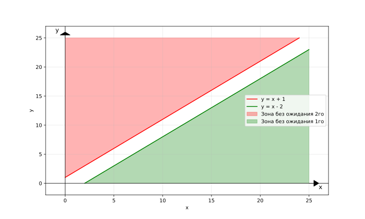

# Лабораторная работа №1

## 1.1 Вероятностное пространство, формула Байеса

### 1. Определить (с обоснованием), зависимы или независимы следующие события:
- Несовметсные события;

    **Решение:**

    По определению **несовместные** событий: $P(AB) = 0$.

    По определению **независимые** событий: $P(AB) = P(A)P(B)$.

    Таким образом: $P(A)P(B) = 0 \Rightarrow  P(A) = 0 \text{ или } P(B) = 0$.

    **Ответ:** несовместные события могут быть независимыми, если одно из них имеет нулевую вероятность, иначе - зависимые.

- Cобытия, образующие $\sigma$-алгебру $\Sigma$ в пространстве $(\Omega, \Sigma, \mathbb{P})$;

    **Решение:**

    По определению $\sigma$-алгебра:
    - если $A \in \sigma$, то $\overline{A} \in \sigma$;
    - если $A_1, \dots, A_n, \dots \in \sigma$, то $A_1 + \dots + A_n + \dots \in \sigma$.

    *Пример:* $\Omega = \left\lbrace1, 2, 3, 4\right\rbrace, \newline \sigma = \left\lbrace\left\lbrace1\right\rbrace, \left\lbrace2\right\rbrace, \left\lbrace3\right\rbrace, \left\lbrace4\right\rbrace,\left\lbrace1, 2\right\rbrace, \left\lbrace1, 3\right\rbrace, \left\lbrace1, 4\right\rbrace, \left\lbrace2, 3\right\rbrace, \left\lbrace2, 4\right\rbrace, \left\lbrace3, 4\right\rbrace, \left\lbrace1, 2, 3\right\rbrace, \left\lbrace1, 2, 4\right\rbrace, \left\lbrace2, 4, 3\right\rbrace\right\rbrace$ 
    
    - $A = \left\lbrace1, 2\right\rbrace, B = \left\lbrace1, 3\right\rbrace$
  
        $P(A) = \frac{1}{2}, \ P(B) = \frac{1}{2}$

        $P(AB) = P({1}) = \frac{1}{4}, \ P(A)P(B) = \frac{1}{4} \Rightarrow A, B - \text{независимые}$  
    - $A = \left\lbrace1, 2, 3\right\rbrace, B = \left\lbrace1, 2\right\rbrace$
        
        $P(A) = \frac{3}{4}, \ P(B) = \frac{1}{2}$

        $P(AB) = P({1, 2}) = \frac{1}{2}, \ P(A)P(B) = \frac{3}{8} \Rightarrow A, B - \text{зависимые}$
    
    **Ответ:** события, образующие $\sigma$-алгебру могут быть как зависимые, так и независимые.

- События, имеющие одинаковую вероятность.

    ToDO

### 2. Опыт заключается в независимом подбрасывании двух симметричных монет. Рассматриваются следующие события:
- $A$ - появление герба на первой монете;
- $B$ - появление решки на первой монете;
- $C$ - появление герба на второй монете;
- $D$ - появление решки на второй монете;
- $E$ - появление хотя бы одного герба;
- $F$ - появление хотя бы одной решки;
- $G$ - появление одного герба и одной решки;
- $H$ - непоявление ни одного герба;
- $K$ - появление двух гербов.

    **Решение:**
    
    $\Omega = \left\lbrace \text{(Г, Р)}, \text{(Р, Г)}, \text{(Г, Г)}, \text{(Р, Р)}, \right\rbrace$
    - $A$ - появление герба на первой монете $\left\lbrace \text{(Г, Р)}, \text{(Г, Г)}\right\rbrace$;
    - $B$ - появление решки на первой монете $\left\lbrace \text{(Р, Р)}, \text{(Р, Г)}\right\rbrace$;
    - $C$ - появление герба на второй монете $\left\lbrace \text{(Г, Г)}, \text{(Р, Г)}\right\rbrace$;
    - $D$ - появление решки на второй монете $\left\lbrace \text{(Г, Р)}, \text{(Р, Р)}\right\rbrace$;
    - $E$ - появление хотя бы одного герба $\left\lbrace \text{(Г, Г)}, \text{(Г, Р)}, \text{(Р, Г)}\right\rbrace$;
    - $F$ - появление хотя бы одной решки $\left\lbrace \text{(Р, Р)}, \text{(Г, Р)}, \text{(Р, Г)}\right\rbrace$;
    - $G$ - появление одного герба и одной решки $\left\lbrace \text{(Г, Р)}, \text{(Р, Г)}\right\rbrace$;
    - $H$ - непоявление ни одного герба $\left\lbrace \text{(Р, Р)}\right\rbrace$;
    - $K$ - появление двух гербов $\left\lbrace \text{(Г, Г)}\right\rbrace$.

    Определим, каким событиям этого списка равносильны следующие события:

    - $A + C = \left\lbrace \text{(Г, Р)}, \text{(Г, Г)}\right\rbrace \cup \left\lbrace \text{(Г, Г)}, \text{(Р, Г)}\right\rbrace = \left\lbrace \text{(Г, Г)}, \text{(Г, Р)}, \text{(Р, Г)} \right\rbrace = E \ \text{(появление хотя бы одного орла)}$

        **Ответ**: $A + C = E$ 
    - $AC = \left\lbrace \text{(Г, Р)}, \text{(Г, Г)}\right\rbrace \cap \left\lbrace \text{(Г, Г)}, \text{(Р, Г)}\right\rbrace = \left\lbrace \text{(Г, Г)} \right\rbrace = K \ \text{(появление двух гербов)}$
  
        **Ответ**: $AC = K$  
    - $EF = \left\lbrace \text{(Г, Г)}, \text{(Г, Р)}, \text{(Р, Г)}\right\rbrace \cap \left\lbrace \text{(Р, Р)}, \text{(Г, Р)}, \text{(Р, Г)}\right\rbrace = \left\lbrace \text{(Г, Р)}, \text{(Р, Г)} \right\rbrace = G \ \text{(появление одного герба и одной решки)}$
     
        **Ответ**: $EF = G$  
    - $G + E = \left\lbrace \text{(Г, Р)}, \text{(Р, Г)}\right\rbrace \cup \left\lbrace \text{(Г, Г)}, \text{(Г, Р)}, \text{(Р, Г)}\right\rbrace = \left\lbrace \text{(Г, Р)}, \text{(Р, Г)}, \text{(Г, Г)} \right\rbrace = E \ \text{(появление хотя бы одного герба)}$
     
        **Ответ**: $G + E = E$ 
    - $GE = \left\lbrace \text{(Г, Р)}, \text{(Р, Г)}\right\rbrace \cup \left\lbrace \text{(Г, Г)}, \text{(Г, Р)}, \text{(Р, Г)}\right\rbrace = \left\lbrace \text{(Г, Р)}, \text{(Р, Г)}\right\rbrace = G \ \text{(появление одного герба и одной решки)}$

        **Ответ**: $GE = G$  
    - $BD = \left\lbrace \text{(Р, Р)}, \text{(Р, Г)}\right\rbrace \cap \left\lbrace \text{(Г, Р)}, \text{(Р, Р)}\right\rbrace = \left\lbrace \text{(Р, Р)}\right\rbrace = H \ \text{(непоявление ни одного герба)}$

        **Ответ**: $GE = H$   
    - $E + K =\left\lbrace \text{(Г, Г)}, \text{(Г, Р)}, \text{(Р, Г)}\right\rbrace \cup \left\lbrace \text{(Г, Г)}\right\rbrace = \left\lbrace \text{(Г, Г)}, \text{(Г, Р)}, \text{(Р, Г)} \right\rbrace = G \ \text{(появление хотя бы одного герба)}$
     
        **Ответ**: $E + K = E$

### 3. Производится выстрел по вращающейся круговой мишени, в которой закрашены два непересекающихся сектора с углом 20◦. Какова вероятность попадания в закрашенную область?

**Решение:**

1. Полный круг - $360\degree$;
2. Два непересекающихся сектора с углом $20\degree \Rightarrow \ \text{общая закрашенная площадь} = 40\degree$
3. Вероятность попадания в закрашенную область: $P = \frac{40\degree}{360\degree} = \frac{1}{9}$
  
**Ответ:** $\frac{1}{9}$

### 4. Два парохода должны подойти к одному и тому же причалу независимо друг от друга и равновозможно в течение суток. Определить вероятность того, что одному из них придется ожидать освобождения причала, если время стоянки первого парохода - 1 час, а второго - 2 часа.

Вероятность того, что одному из них придется ожидать освобождения причала = 1 - вероятность того, что никто из них не будет ждать освобождения причала

**Решение:**

Пусть $x$ - момент прибытия 1го корабля, $y$ - 2го; $x, y \in [0, 24]$.

Время стоянки 1го корабля: $x, x + 1$.

Время стоянки 2го корабля: $y, y + 2$.

Если **1й пришел раньше** ($x \ge y$): для того, чтобы **2й корабль не ждал**, он должен прийти в момент $y \ge x + 1$.

Если **2й пришел раньше** ($y > x$): для того, чтобы **1й корабль не ждал**, он должен прийти в момент $x \le y - 2$.

Получаем систему уравнений:

$$
\left\lbrace \begin{array}{cl}
y \ge x + 1, & x \ge y\\
y \le x - 2, & x \le y
\end{array} \right. 
$$

Найдем закрашенные площади: $23 * 23 * 0.5 + 22 * 11 = 506.5$.

Вероятность того, что никто **не будет** ождать: $\frac{506.5}{576}$.

Вероятность того, что один из них **будет** ождать: $1 - \frac{506.5}{576} = \frac{69.5}{576} = \frac{139}{1152}$

**Ответ:** $\frac{139}{1152}$

### 5. Самолет, по которому ведется стрельба, состоит из трех различных по уязвимости частей:
1. Кабина летчика и двигатель
2. Топливные баки
3. Планер

Для поражения самолета достаточно либо одного попадания в первую часть, либо двух попаданий во вторую, либо трех в третью. При попадании в самолет одного снаряда, снаряд с вероятностью p1 попадает в первую часть, с вероятностью p2 — во вторую, с вероятностью p3 — в третью. Попавшие снаряды распределяются по частям независимо друг от друга. Известно, что в самолет попало m снарядов. Найти условную вероятность P(A|m) события A – «Самолет поражен» – при m = 1, 2, 3, 4

**Решение:**

Введем $p_0 = 1 - p_1 - p_2 - p_3$ - вероятность не попасть в самолет (промах).

Событие $A$ - самолет поражен.

Пусть $X_1, X_2, X_3$ - число попаданий в части 1 - 3 при $m$ выстрелах. Это полиномиальное распределение.

$$
A = \left\lbrace X_1 \ge 1 \right\rbrace \cup \left\lbrace X_2 \ge 2\right\rbrace \cup \left\lbrace X_3 \ge 3\right\rbrace
$$

Вероятность $(P)$ того, что исход 1 произойдёт ровно $n_1$ раз, исход 2 - ровно $n_2$ раз, …, исход k - ровно $n_k$ раз, вычисляется по формуле: $P = \frac{n!}{n1! × n2! × … × nk!} * (p_1^{n_1} × p_2^{n_2} × … × p_k^{n_k}), где n = n_1 + n_2 + … + n_k$.

1. m = 1

    Самолет был сбит с 1го раза, то есть сразу попали в **часть 1**.

    $P(A | m = 1) = p_1^1p_2^0p_3^0p_0^0 = p_1$
3. m = 2
   
   Самолет был сбит со 2го раза, то есть:
   - 2 раза били в **часть 2**
   - первый раз попали не в **часть 1**, второй в **часть 1**
  
    $P(A | m = 2) = p_2 ^ 2 + (1 - p_1)p_1 = p_1 - p_1^2 + p_2 ^ 2$
4. m = 3
   
   Рассмотрим собитие $\bar{A}: \left\lbrace X_1 = 0 \right\rbrace \cup \left\lbrace X_2 \le 1\right\rbrace \cup \left\lbrace X_3 \le 2\right\rbrace$

   - $X_2 = 0, X_3 = 0, 1, 2$ - все 3 попадания в мимо
    $$
    P = \sum_{k = 0}^{2}
    \frac{3!}{k!(3-k)!}^{k}p_{3}^{k}p_{0}^{3 - k}
    $$
   - $X_2 = 1, X_3 = 0, 1, 2$
    $$
    P = \sum_{k = 0}^{2} \frac{3!}{1!k!(2-k)!}p_{2}p_{0}^{k}p_{3}^{3 - k}
    $$ 
    
    $P(A | m = 3) = 1 - \sum_{k = 0}^{2} \frac{3!}{k!(3-k)!} p_{3}^{k}p_{0}^{3 - k} - \sum_{k = 0}^{2} \frac{3!}{1!k!(2-k)!}p_{2}p_{0}^{k}p_{3}^{3 - k}$
5. m = 4

## 1.2 Cлучайный вектор и числовые характеристики

### 1. Пусть

$$
f_{\xi} = \frac{e^{-2 |y|}}{\pi(1 + x^2)}
$$

Является ли данная функция плотностью распределения случайного
вектора?

$$
\begin{array}{|c|c|c|c|}
\hline
\xi \backslash \eta & -1 & 0 & 1 \\
\hline
-1 & \frac{1}{8} & \frac{1}{12} & \frac{7}{24} \\
\hline
1 & \frac{1}{3} & \frac{1}{6} & 0 \\
\hline
\end{array}
$$

### 2. Совместное распределение случайных величин ξ и η задано следующей таблицей

 - Найти маргинальные распределения $\xi$ и $\eta$
    
    **Решение:**
 - Вычислить математическое ожидание, ковариационную и корреляционную матрицы вектора $(\xi, \eta)$

    **Решение:**
 - Исследовать $\xi$ и $\eta$ на независимость и некоррелированность

    **Решение:**

### 3. Пусть имеются два одинаковых тетраэдра с числами 1, 2, 3, 4 на гранях. Подкидываем оба и смотрим на выпавшие числа ξ1 и ξ2. Зададим следующие случайные величины:

$$
\phi_1 = \xi_1 + \xi_2 \quad \phi_2 = \left\lbrace \begin{array}{cl}
1, & (\xi_1 \vdots \xi_2) \ \cup \ (\xi_2 \vdots \xi_1)\\
0, & \text{else}
\end{array} \right. 
$$

- Cоставить таблицу совместного распределения $\phi_1$ и $\phi_2$
  
    **Решение:**
- Найти маргинальные распределения $\phi_1$ и $\phi_2$
  
    **Решение:**
- Вычислить математическое ожидание, ковариационную и корреляционную матрицы вектора $(\phi_1, \phi_2)$
  
    **Решение:**
- Исследовать $\phi_1$ и $\phi_2$ на независимость и некоррелированность

    **Решение:**

### 4. Пусть $\xi \sim \text{U}_{-\pi, \pi}$ и $\eta_1 = \cos{\xi}, \eta_2 = \sin{\xi}$

- Вычислить математическое ожидание, ковариационную и корреляционную матрицы вектора $(\eta_1, \eta_2)$
  
    **Решение:**
- Исследовать $\eta_1$ и $\eta_2$ на независимость и некоррелированность

    **Решение:**

### 5. Найти плотность распределения суммы двух независимых случайных величин $\xi$ и $\eta$, если $\xi \sim \text{Exp}_2$ и $\eta \sim \text{U}_{0, 1}$ 

**Решение:**

**Ответ:**